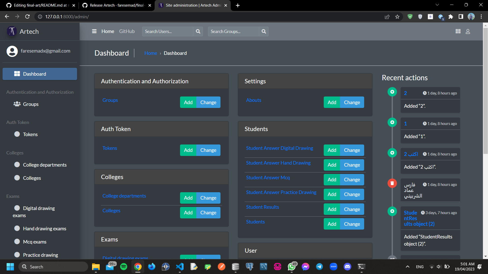
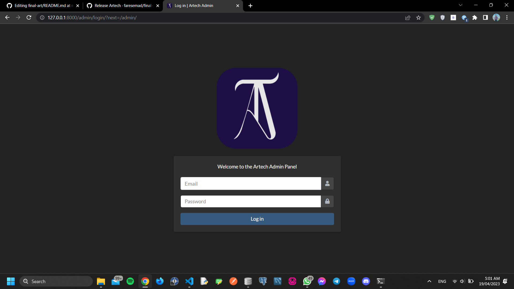

#  Artech Graduation Project

[](https://github.com/faresemad/final-art/)
[](https://github.com/faresemad/final-art/tags/v1.0.0)
[](https://opensource.org/licenses/MIT)
[](https://www.linkedin.com/in/faresemad/)

## Description
This is a graduation project for Artech company. This project is a website for art exams. This project is made by Django framework and Python programming language. This project is made by [Fares Emad](https://github.com/faresemad/)

## Installation

- Create Virtual Enviroment ```python3 -m venv env```.

- Activate Enviroment on Linux ```source env/bin/activate```, on Windows ```.env\Scripts\activate```.

- Download Project ```git clone https://github.com/faresemad/final-art.git```.

- ```cd final-art```

- ```pip install -r requirements.txt```

- ```python manage.py makemigrations```

- ```python manage.py migrate```

- ```python manage.py createsuperuser```

- ```python manage.py runserver```

<h1 align="center">Admin Panel</h1>


<h1 align="center">Login Page</h1>

